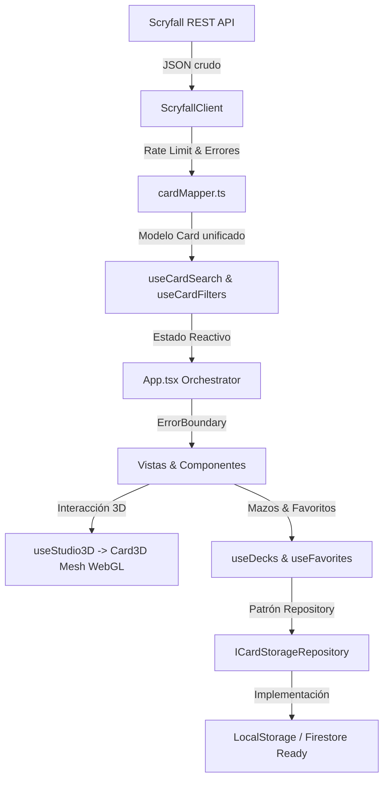

# Arquitectura Técnica del Sistema

## 🏗️ Stack Tecnológico

| Capa | Tecnología | Versión / Detalle | Propósito |
| :--- | :--- | :--- | :--- |
| **Frontend Core** | React + TypeScript | 18.x / Strict Mode | SPA reactiva modular desacoplada en Custom Hooks |
| **Enrutamiento** | React Router DOM | 7.x / `<BrowserRouter>` | URLs reales (`/card/:id`, `/catalog`), historial y Vercel SPA Ready |
| **Motor 3D** | Three.js + R3F + Drei | 0.173.x / 8.x | Renderizado WebGL, shaders Foil/Etched y cámara orbital |
| **Estilos** | CSS Vanilla Modular | `src/index.css` | Glassmorphism, tokens HSL y rendimiento sin sobrecarga de CSS runtime |
| **Fuente de Datos** | Scryfall REST API | `https://api.scryfall.com` | Catálogo completo de MTG, legalidades, precios y artes alternativos |
| **Persistencia** | Repository Pattern | LocalStorage / Firestore Ready | Abstracción limpia `ICardStorageRepository` |
| **Iconografía & Tipografía** | Lucide React + Cinzel | 0.475.x + Google Fonts | Iconos vectoriales y tipografía medieval |
| **Bundler & Tooling** | Vite | 6.x | Servidor de desarrollo HMR ultrarrápido y compilador de producción |
| **Despliegue** | Vercel / Netlify | `vercel.json` | Rewrites SPA hacia `/index.html` para soporte de rutas directas |

---

## 📁 Estructura del Código Fuente

```text
src/
├── App.tsx                       # Orquestador principal de rutas y modales (<360 líneas)
├── main.tsx                      # Punto de entrada de React en el DOM
├── index.css                     # Sistema de diseño, tokens de color noble y clases utilitarias
├── vite-env.d.ts                 # Declaraciones de tipos para Vite
├── constants/                    # Constantes centralizadas y eliminación de Magic Numbers
│   ├── card3D.ts                 # Medidas geométricas MTG, velocidades lerp y texturas
│   └── scryfall.ts               # Timeouts de API, delays, debounce y queries por defecto
├── types/                        # Definiciones TypeScript de dominio
│   ├── card.ts                   # Modelo limpio de Carta (Card, Finishes, Legalities)
│   ├── filters.ts                # Tipos para filtros avanzados de búsqueda
│   └── navigation.ts             # Rutas SPA de la aplicación (AppRoute)
├── hooks/                        # Custom Hooks de Estado y Lógica Desacoplada
│   ├── useCardSearch.ts          # Búsqueda Scryfall, debounce, autocompletado y catálogo
│   ├── useCardFilters.ts         # Filtros avanzados, ordenamiento y activeFilterCount memoizado
│   ├── useFavorites.ts           # Gestión de favoritos con persistencia
│   ├── useDecks.ts               # Gestión completa de mazos (crear, editar, importar)
│   ├── useStudio3D.ts            # Configuración del visor 3D (acabados, giro, partículas, cámara)
│   ├── useDeckPicker.ts          # Orquestación del modal y asignación de cartas a mazos
│   ├── useGlobalHotkeys.ts       # Manejo de atajos globales de teclado (ESPACIO, F, E, N, R, ?)
│   └── useToast.ts               # Notificaciones toast reactivas con auto-cierre
├── services/                     # Capa de integración, persistencia y red
│   ├── storage/                  # Patrón Repository de Persistencia
│   │   └── cardStorage.ts        # Contrato ICardStorageRepository y LocalStorageCardRepository
│   ├── scryfall/                 # Integración oficial con Scryfall
│   │   ├── types.ts              # Tipos crudos del payload de Scryfall
│   │   ├── errors.ts             # Clases de error HTTP tipadas (404, 429, Timeout)
│   │   ├── scryfallClient.ts     # Cliente HTTP con rate limiting (80ms) y AbortController
│   │   ├── cardMapper.ts         # Mapper de ScryfallCard a Card (resuelve DFC y legalidades)
│   │   └── index.ts              # Exportación unificada de servicios Scryfall
│   └── boosterSimulator.ts       # Simulador probabilístico de sobres Draft (BOOSTER_CONFIG)
├── three/                        # Motor y escenas 3D (WebGL)
│   ├── Scene.tsx                 # Escena principal con Canvas, iluminación y fondo de santuario
│   ├── Card3D.tsx                # Modelo 3D de la carta (geometría MTG con CARD_DIMENSIONS y lerps)
│   ├── BoosterScene.tsx          # Escena 3D para la apertura de sobres
│   ├── BoosterPack3D.tsx         # Modelo 3D del paquete de sobre sellado
│   ├── CardReveal3D.tsx          # Carta 3D interactiva en fase de revelación
│   ├── CameraController.tsx      # Controles de órbita Drei con amortiguación suave
│   ├── Lighting.tsx              # Iluminación de estudio física (frontal, posterior y relleno)
│   ├── ManaParticles.tsx         # Partículas etéreas flotantes según color de maná
│   ├── Table.tsx                 # Pedestal de pizarra y anillo rúnico de apoyo
│   └── index.ts                  # Exportación unificada de componentes 3D
├── components/                   # Componentes UI reutilizables
│   ├── common/                   # Componentes transversales y de resiliencia
│   │   ├── ErrorBoundary.tsx     # Captura de excepciones WebGL y de renderizado
│   │   └── ArcaneLoader.tsx      # Spinner estilizado de carga diferida (Suspense / Code-Splitting)
│   ├── navigation/               # Barra de navegación principal y búsqueda
│   │   ├── Navbar.tsx            # Navbar fija con logo, cápsula de búsqueda y atajos
│   │   ├── SearchBar.tsx         # Barra de búsqueda con debounce y autocompletado en vivo
│   │   ├── NavLinks.tsx          # Enlaces directos a Inicio, Catálogo, Mazos, Colección y Sobres
│   │   └── ProfileDropdown.tsx   # Menú flotante de perfil de usuario y métricas en la nube
│   ├── booster/                  # Módulos del simulador de sobres 3D
│   │   ├── BoosterHeader.tsx     # Selector de expansión y botón de retorno
│   │   ├── BoosterControls.tsx   # Controles de paso a paso, volteo y progreso de 15 cartas
│   │   └── BoosterSummaryModal.tsx # Cuadrícula final de 15 cartas con valor total en Soles
│   ├── auth/                     # Autenticación y gestión de usuarios
│   │   └── AuthModal.tsx         # Modal de inicio de sesión, registro, Google e Invitado
│   ├── cards/                    # Componentes de cartas 2D
│   │   ├── QuickViewModal.tsx    # Modal de previsualización rápida 2D
│   │   └── CardVariantsModal.tsx # Modal de selección de ilustraciones y variantes históricas
│   ├── deck/                     # Submódulos del constructor y analizador de mazos
│   │   ├── DeckSidebar.tsx       # Barra lateral con lista y selector de mazos
│   │   ├── DeckStatsPanel.tsx    # Gráfico de barras de curva de maná y desglose
│   │   ├── DeckCardList.tsx      # Lista de cartas agrupada por tipo con botones +/-
│   │   ├── DeckCreateModal.tsx   # Modal de creación de nuevo mazo
│   │   └── DeckExportModal.tsx   # Modal de exportación a MTG Arena, TXT y enlaces 3D
│   ├── BoosterOpener.tsx         # Coordinador ligero de apertura de sobres
│   ├── CardInfoPanel.tsx         # Códice técnico MTG (pestaña deslizable, maná SVG, legalidades)
│   ├── SearchResultsDrawer.tsx   # Drawer lateral izquierdo con sinergias recomendadas
│   ├── CollectorToolbar.tsx      # Dock inferior (Normal, Foil, Etched, Volteo, Variantes de arte)
│   ├── AdvancedFilters.tsx       # Modal de filtros avanzados por maná, tipo y rareza
│   ├── DeckPickerModal.tsx       # Modal selector para agregar cartas a mazos
│   ├── ManaSymbol.tsx            # Renderizador SVG de símbolos de maná oficiales Scryfall
│   ├── ManaCost.tsx              # Parser de costes de maná en cadena
│   ├── OracleText.tsx            # Renderizador de texto de reglas con glifos SVG incrustados
│   └── HotkeyHelpModal.tsx       # Modal de atajos de teclado (ESPACIO, V, /, ESC)
├── pages/                        # Páginas y vistas principales
│   ├── HomeFeed.tsx              # Hero cinemático con cartas destacadas y acceso al visor 3D
│   ├── CatalogGrid.tsx           # Catálogo con cuadrícula responsiva y carga infinita
│   ├── CardDetailPage.tsx        # Estudio 3D inmersivo de inspección técnica
│   ├── DeckBuilderPage.tsx       # Constructor de mazos con desglose por tipo
│   ├── Deck3DPage.tsx            # Visualizador 3D de mazo apilado
│   └── CollectionPage.tsx        # Colección de cartas favoritas persistidas
├── services/                     # Capa de Servicios Externos
│   ├── firebase/                 # Servicios Cloud de Firebase
│   │   ├── firebaseConfig.ts     # Inicialización del SDK modular de Firebase
│   │   ├── authService.ts        # Métodos de autenticación (Email, Google, Invitado)
│   │   └── firestoreService.ts   # Sincronización de mazos y favoritos en Cloud Firestore
│   ├── scryfall/                 # Integración oficial con API Scryfall
│   │   ├── scryfallClient.ts     # Cliente HTTP con rate limit (80ms) y timeouts
│   │   ├── cardMapper.ts         # Transformación de payloads crudos al modelo de dominio
│   │   └── errors.ts             # Jerarquía de errores tipados (404, 429, Timeout)
│   ├── storage/                  # Patrón Repository de Persistencia
│   │   └── cardStorage.ts        # ICardStorageRepository y LocalStorageCardRepository
│   └── boosterSimulator.ts       # Algoritmo probabilístico de sobres de Draft de 15 cartas
└── utils/                        # Utilidades y funciones puras
    ├── pricing.ts                # Constante USD_TO_PEN_RATE (3.75) y formateo en Soles (S/.)
    ├── manaColors.ts             # Algoritmo de cálculo de auras cromáticas de maná
    └── sharing.ts                # Codificación y decodificación de enlaces compartibles
```

---

## 🔄 Flujo de Datos y Arquitectura de Estado



---

## 🎨 Pipeline de Renderizado 3D

1. **Caché Global de Texturas**: Mapa estático `textureCache` que reutiliza texturas WebGL evitando recolecciones de basura (*GC*) y caídas de fotogramas.
2. **Geometría MTG Paramétrica (`CARD_DIMENSIONS`)**: Dimensiones exactas (2.5 x 3.5), esquinas redondeadas auténticas (radio 0.12) y extrusión física (profundidad 0.016).
3. **Mapeo UV Inverso**: Coordenadas UV proyectadas de 0 a 1 que permiten rotar la cara trasera sin espejar el texto.
4. **Interpolación Suave (`ANIMATION_CONSTANTS`)**: `ROTATION_LERP_SPEED` (0.22) y `SCALE_LERP_SPEED` (0.12) para transiciones fluidas de cámara y volteo.
5. **Shaders de Acabados Físicos**:
   - **Normal**: `MeshStandardMaterial` con rugosidad calculada.
   - **Foil**: `MeshPhysicalMaterial` con iridiscencia espectral (IOR 1.45, rango 140-500nm).
   - **Etched**: `MeshPhysicalMaterial` con micro-relieve metálico (rugosidad 0.38, metalicidad 0.7).

---

## 🛡️ Matriz de Auditoría y Solución de Problemas Identificados

A continuación se detalla la resolución técnica aplicada a los 10 puntos auditados del sistema:

| # | Problema Auditado | Diagnóstico Inicial | Solución Técnica Implementada | Módulos / Archivos Involucrados |
| :-: | :--- | :--- | :--- | :--- |
| **1** | **App.tsx "Componente Dios"** | Exceso de `useState`, `useEffect` sin dependencias y mezcla de responsabilidades. | Extracción y desacoplamiento en 9 Custom Hooks especializados (`useCardSearch`, `useCardFilters`, `useDecks`, `useStudio3D`, etc.). `App.tsx` quedó reducido a un orquestador declarativo y limpio. | `src/App.tsx`<br>`src/hooks/*` |
| **2** | **Routing Obsoleto** | Navegación basada en variables de estado (`appMode`) sin rutas bookmarkables. | Implementación completa de **React Router DOM v7** con URLs canónicas (`/catalog`, `/card/:id`, `/decks`, `/deck-3d/:deckId?`, `/collection`, `/booster`), soporte para botón Atrás/Adelante y deep linking con payload (`?deck=...`). | `src/App.tsx`<br>`src/types/navigation.ts`<br>`vercel.json` |
| **3** | **Estado Derivado sin Memoization** | Recálculos en render inline (`activeFilterCount`, resúmenes de búsqueda). | Todos los cómputos derivados fueron envueltos en `useMemo` y funciones memorizadas con `useCallback` para evitar re-renderizados innecesarios del árbol. | `src/hooks/useCardFilters.ts`<br>`src/hooks/useCardSearch.ts`<br>`src/pages/Deck3DPage.tsx` |
| **4** | **Riesgo de Fuga en Event Listeners** | `window.addEventListener('keydown')` dispersos sin garantías de ciclo de vida. | Centralización en el hook `useGlobalHotkeys`, que registra los listeners de atajos globales y garantiza su remoción limpia (`removeEventListener`) en la función de limpieza de `useEffect`. | `src/hooks/useGlobalHotkeys.ts` |
| **5** | **Magic Numbers Esparcidos** | Dimensiones 3D, velocidades de lerp y timeouts de red sin nombres ni contexto. | Centralización formal en constantes inmutables en `src/constants/card3D.ts` (`CARD_DIMENSIONS`, `ANIMATION_CONSTANTS`, `TEXTURE_URLS`) y `src/constants/scryfall.ts` (`SCRYFALL_CONFIG`). | `src/constants/card3D.ts`<br>`src/constants/scryfall.ts` |
| **6** | **Type Assertions `as any`** | Casteos no seguros en el simulador de sobres y modelos de datos. | 0 ocurrencias de `any`. Se introdujo la función `normalizeBoosterRarity()` y tipos de unión estrictos para rarezas MTG (`'common' \| 'uncommon' \| 'rare' \| 'mythic'`). | `src/services/boosterSimulator.ts`<br>`src/types/card.ts` |
| **7** | **Persistencia y Favoritos en Firestore** | Interfaces declaradas pero sin sincronización real con la nube. | Integración completa de **Firebase Authentication** y **Cloud Firestore** (`firestoreService.ts`), con sincronización reactiva en tiempo real (`subscribeToCloudDecks`) y soporte offline/anónimo mediante `LocalStorageCardRepository`. | `src/services/firebase/*`<br>`src/services/storage/*`<br>`src/hooks/useFavorites.ts` |
| **8** | **Manejo de Errores Inconsistente** | Capturas de error genéricas y falta de tipado en excepciones de red. | Jerarquía formal `ScryfallError` (con códigos 404, 429, 500), protección perimetral con `ErrorBoundary` para WebGL y notificaciones flotantes con `useToast`. | `src/services/scryfall/errors.ts`<br>`src/components/common/ErrorBoundary.tsx` |
| **9** | **Efectos Demo y Partículas en Exceso** | Sobrecarga de partículas activadas por defecto y aspecto de "videojuego". | Partículas desactivadas por defecto (`enableParticles: false`), iluminación física de estudio sobria y paleta noble mate MTG (grafito, pizarra y oro `#c5a059`), orientada a un visor técnico y analítico profesional. | `src/three/ManaParticles.tsx`<br>`src/three/Lighting.tsx`<br>`src/styles/variables.css` |
| **10** | **Diseño Responsivo y Breakpoints** | Falta de adaptabilidad programática en pantallas móviles y 3D. | Creación de los hooks `useMediaQuery` y `useResponsive` (`isMobile`, `isTablet`, `isDesktop`), junto con arquitectura CSS modular en `src/styles/base.css` y `src/styles/catalog.css` con soporte para drawers móviles y layouts fluidos. | `src/hooks/useMediaQuery.ts`<br>`src/styles/base.css`<br>`src/styles/catalog.css` |