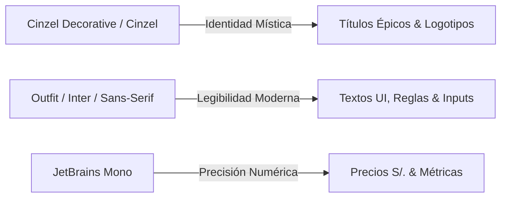

# Sistema de Diseño UI/UX — Magic 3D Explorer

---

## 1. 🏛️ Filosofía y Principios de Experiencia de Usuario (UX)

*Magic 3D Explorer* está concebido bajo la metáfora del **Sanctum Arcano**: una biblioteca mágica mística, noble y oscura donde los Planeswalkers examinan reliquias, construyen grimorios de combate y abren sobres coleccionables con física real.

### Principios Rectores:
1. **Inmersión Sin Distracciones (*Content First*)**: La interfaz oscura y sobria permite que el arte original de las cartas de *Wizards of the Coast* sea el auténtico protagonista visual.
2. **Nobleza Cromática (*Zero Neon Policy*)**: Prohibición total de colores fluorescentes, amarillos chillones o cianes sintéticos. La paleta se fundamenta en pizarras profundas, grafito volcánico y oro mate bruñido (`#c5a059`).
3. **Respuesta Táctil y Tridimensional**: Cada carta reacciona a la luz, al cursor y a la gravedad mediante WebGL/Three.js a 60 FPS.
4. **Ergonomía de Teclado para Jugadores**: Soporte nativo para atajos de teclado globales (`ESPACIO`, `F`, `E`, `N`, `R`, `/`, `?`), permitiendo una navegación fluida sin tocar el ratón.

---

## 2. 🎨 Tokens de Diseño y Paleta Cromática

### 2.1 Colores Base y Superficies (Dark Mode Nobility)

| Token CSS | Valor HEX / RGBA | Uso en la Interfaz |
| :--- | :--- | :--- |
| `--bg-primary` | `#080a0f` | Fondo raíz de la aplicación y canvas 3D. |
| `--bg-secondary` | `#0d111a` | Fondos de contenedores y paneles secundarios. |
| `--bg-surface` | `rgba(18, 22, 32, 0.95)` | Superficies elevadas de modales y drawers. |
| `--border-subtle` | `rgba(255, 255, 255, 0.06)` | Separadores y bordes de baja prominencia. |
| `--border-medium` | `rgba(255, 255, 255, 0.12)` | Contornos de tarjetas, botones y campos input. |
| `--accent-gold` | `#c5a059` | Acento principal: títulos, precios, estados activos y focos. |
| `--accent-gold-hover` | `#d8b46e` | Estado hover de botones primarios. |
| `--accent-gold-subtle` | `rgba(197, 160, 89, 0.12)` | Fondos de selección y estados activos de navegación. |

### 2.2 Identidades de Maná MTG (Armonía Desaturada)

| Identidad | Color Simbólico | Aplicación en UI |
| :--- | :--- | :--- |
| **Blanco ({W})** | `#fdf7d9` (Marfil suave) | Símbolo de llanura, auras y filtros. |
| **Azul ({U})** | `#0e68ab` (Zafiro abisal) | Símbolo de isla, partículas y auras. |
| **Negro ({B})** | `#1c1917` (Obsidiana) | Símbolo de pantano y acabados oscuros. |
| **Rojo ({R})** | `#d13b2c` (Rubí volcánico) | Símbolo de montaña y fuego de maná. |
| **Verde ({G})** | `#00733e` (Esmeralda bosque) | Símbolo de bosque y vida. |
| **Incoloro ({C})** | `#94a3b8` (Pizarra metálica) | Artefactos y tierras incoloras. |

### 2.3 Rarezas Oficiales MTG

| Rareza | Color de Borde / Insignia | Significado |
| :--- | :--- | :--- |
| **Común (Common)** | `#94a3b8` (Gris Pizarra) | Cartas base de sobre y catálogo. |
| **Infrecuente (Uncommon)** | `#60a5fa` (Plata Azulada) | Cartas de soporte táctico. |
| **Rara (Rare)** | `#c5a059` (Oro Bruñido) | Cartas de alto impacto en juego. |
| **Mítica (Mythic)** | `#ea580c` (Ámbar Fuego) | Planeswalkers y legendarias icónicas. |

---

## 3. ✍️ Tipografía y Jerarquía Visual



1. **Titulares y Épica (`var(--font-heading)`)**:
   - **Familias**: *Cinzel Decorative*, *Cinzel*, *Trajan Pro*, serif.
   - **Uso**: Logotipo de Navbar, títulos de sección, cabeceras de modales y nombres de cartas en visor 3D.
2. **Lectura y Controles UI (`var(--font-sans)`)**:
   - **Familias**: *Outfit*, *Inter*, system-ui, sans-serif.
   - **Uso**: Botones, campos de formulario, descripciones, texto Oracle de reglas y metadatos.
3. **Métricas y Cotización (`var(--font-mono)`)**:
   - **Familias**: *JetBrains Mono*, monospace.
   - **Uso**: Precios en Soles peruanos (`S/. 12.50`), contadores de maná y estadísticas de combate (`4/4`).

---

## 4. 🪟 Sistema de Capas y Glassmorphism Noble

Todas las ventanas modales, barras y cajones deslizables comparten una arquitectura visual coherente:

1. **Backdrop Blur Inmersivo**:
   ```css
   background: rgba(7, 9, 13, 0.82);
   backdrop-filter: blur(14px);
   -webkit-backdrop-filter: blur(14px);
   ```
2. **Contenedor Orgánico Flotante**:
   ```css
   background: linear-gradient(155deg, rgba(20, 24, 35, 0.98), rgba(11, 14, 20, 0.99));
   border: 1px solid rgba(197, 160, 89, 0.25);
   border-radius: 18px;
   box-shadow: 0 24px 64px rgba(0, 0, 0, 0.75), 0 0 0 1px rgba(255, 255, 255, 0.04);
   ```
3. **Animación de Entrada Suave**:
   ```css
   animation: slideUpFade 0.2s cubic-bezier(0.16, 1, 0.3, 1);
   ```

---

## 5. 🧩 Catálogo de Componentes UI Principales

### 5.1 Barra de Navegación Superior (`Navbar.tsx`)
* **Posición**: Fija superior (*Sticky/Fixed Glass*), altura `60px`.
* **Elementos de Izquierda a Derecha**:
  1. *Logo Arcane*: Isotipo de orbe dorado + tipografía Cinzel "Magic 3D".
  2. *Cápsula de Búsqueda*: Input con autocompletado en vivo con sugerencias flotantes, indicador de atajo `/` y debounce de red.
  3. *Enlaces de Navegación*: Píldoras activas con icono + etiqueta (*Catálogo, Mazos, Sobres 3D, Colección*).
  4. *Carta Aleatoria*: Botón de dado con micro-animación de tirada.
  5. *Píldora de Perfil / Acceder*: Botón de acceso directo a autenticación o modal de perfil con avatar y nombre.

### 5.2 Estudio y Visor 3D (`CardDetailPage.tsx` + `Card3D.tsx`)
* **Cámara de Estudio**: Encuadre holgado con FOV `42` y distancia `6.2` para visión completa sin cortes.
* **Top Bar Flotante**: Botón volver con historial inteligente (`navigate(-1)`), insignia de nombre centrada matemáticamente en pantalla y botón de favoritos.
* **Dock Inferior de Acabados (`CollectorToolbar.tsx`)**:
  - Selector de acabado: *Normal*, *Foil* (arcoíris dinámico) y *Etched* (metálico).
  - Botón de volteo 3D con atajo `ESPACIO`.
  - Botón de variantes de arte con atajo `V`.
* **Códice MTG (Drawer Derecho `CardInfoPanel.tsx`)**:
  - Glifos vectoriales SVG incrustados en tiempo real para todos los símbolos de maná.
  - Tabla de legalidades por formato (Standard, Commander, Modern, etc.).
* **Drawer de Sinergias (Drawer Izquierdo `SearchResultsDrawer.tsx`)**:
  - Cartas con alta afinidad recomendadas con caché en memoria sin parpadeos.

### 5.3 Simulador de Sobres 3D (`BoosterOpener.tsx`)
* **Apertura Cinemática**: Empaque sellado con brillo iridiscente que se desgarra al hacer clic.
* **Barra de Progreso de 15 Cartas**: Indicadores circulares codificados por rareza (*10 Comunes, 3 Infrecuentes, 1 Rara/Mítica, 1 Foil*).
* **Modal de Resumen Final**: Cuadrícula con las 15 cartas, cálculo del *Top Pull* y cotización acumulada en Soles (`S/.`).

### 5.4 Constructor de Mazos (`DeckBuilderPage.tsx`)
* **Sidebar Modular**: Lista de mazos con indicador de cartas totales, formato y botón de creación.
* **Panel de Estadísticas (`DeckStatsPanel.tsx`)**: Curva de maná interactiva por coste de maná convertido (CMC 0 a 7+) y desglose de tipos.
* **Lista de Cartas (`DeckCardList.tsx`)**: Agrupada por Criaturas, Conjuros, Instantáneos, Artefactos, Encantamientos y Tierras con controles de cantidad `+` / `-`.

### 5.5 Sistema de Modales de Autenticación y Perfil
* **Modal de Acceso (`AuthModal.tsx`)**: Pestañas de *Iniciar Sesión*, *Crear Cuenta*, *Recuperar Contraseña*, botón de *Google* y *Modo Invitado* en estilo sobrio.
* **Modal de Perfil (`ProfileModal.tsx`)**: Avatar visual, edición de nombre de usuario en caliente, métricas de mazos/favoritos en la nube y botón de sincronización manual.

### 5.6 Indicador de Carga Arcane (`ArcaneLoader.tsx`)
* Diseñado para las transiciones perezosas de Three.js con doble anillo concéntrico en oro mate y tipografía de carga elegante.

---

## 6. ⌨️ Mapa de Atajos de Teclado (Ergonomía UX)

| Atajo | Acción en la Interfaz | Contexto |
| :---: | :--- | :--- |
| **`ESPACIO`** | Voltear carta 180° en 3D (Anverso / Reverso) | Visor 3D & Sobres |
| **`F`** | Activar acabado Iridiscente **Foil** | Visor 3D |
| **`E`** | Activar acabado Relieve Metálico **Etched** | Visor 3D |
| **`N`** | Activar acabado Mate Tradicional **Normal** | Visor 3D |
| **`R`** | Activar / Desactivar Auto-Rotación Cinemática | Visor 3D |
| **`V`** | Abrir Galería de Variantes de Arte Históricas | Visor 3D |
| **`/`** | Enfocar barra de búsqueda global | Global |
| **`ESC`** | Cerrar cualquier modal o drawer activo | Global |
| **`?`** | Abrir panel de ayuda de atajos | Global |

---

## 7. 🛡️ Criterios de Aceptación y Calidad Visual

1. **0% Colores Neón**: Queda terminantemente vetado cualquier tono amarillo fluorescente o cian brillante.
2. **Fluidez a 60 FPS**: Ninguna animación o transición en Three.js o CSS debe bloquear el hilo principal.
3. **Moneda Local Obligatoria**: Todos los precios y cotizaciones deben mostrarse en Soles (`S/.`) calculados a una tasa de `3.75 PEN / USD`.
4. **Contraste WCAG AA**: Los textos principales deben mantener un contraste mínimo de `4.5:1` sobre los fondos oscuros.
